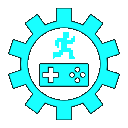

# godot-bootstrap

> _**[Play the game!](TODO)**_

_TODO: Game plot description / call-to-action_

TODO: Game technical description

TODO: Search/replace all instances of bootstrap with the app name.

## Software used

-   [Godot](https://godotengine.org/): Game engine.
-   [Aseprite](https://www.aseprite.org/): Pixel-art image editor.
-   [Bfxr](https://www.bfxr.net/): Sound effects editor.
-   [DefleMask](https://deflemask.com/): Chiptune music tracker.
-   [Scaffolder](https://godotengine.org/asset-library/asset/969): A framework from the Godot Asset Library that enables procedural path-finding across 2D platforms.
-   [Surfacer](https://godotengine.org/asset-library/asset/968): A framework from the Godot Asset Library that provides some general app infrastructure.

## Licenses

-   The code is published under the [MIT license](LICENSE).
-   The art assets (files under `assets/images/`, `assets/music/`, and `assets/sounds/`) are published under the [CC0 1.0 Universal license](https://creativecommons.org/publicdomain/zero/1.0/deed.en).
-   This project depends on various pieces of third-party code that are licensed separately. Here are lists of these third-party licenses:
    -   [addons/scaffolder/src/config/scaffolder_third_party_licenses.gd](https://github.com/SnoringCatGames/scaffolder/blob/master/src/config/scaffolder_third_party_licenses.gd)
    -   [addons/surfacer/src/config/surfacer_third_party_licenses.gd](https://github.com/SnoringCatGames/surfacer/blob/master/src/config/surfacer_third_party_licenses.gd)
    -   [src/config/third_party_licenses.gd](./src/config/third_party_licenses.gd)

  

